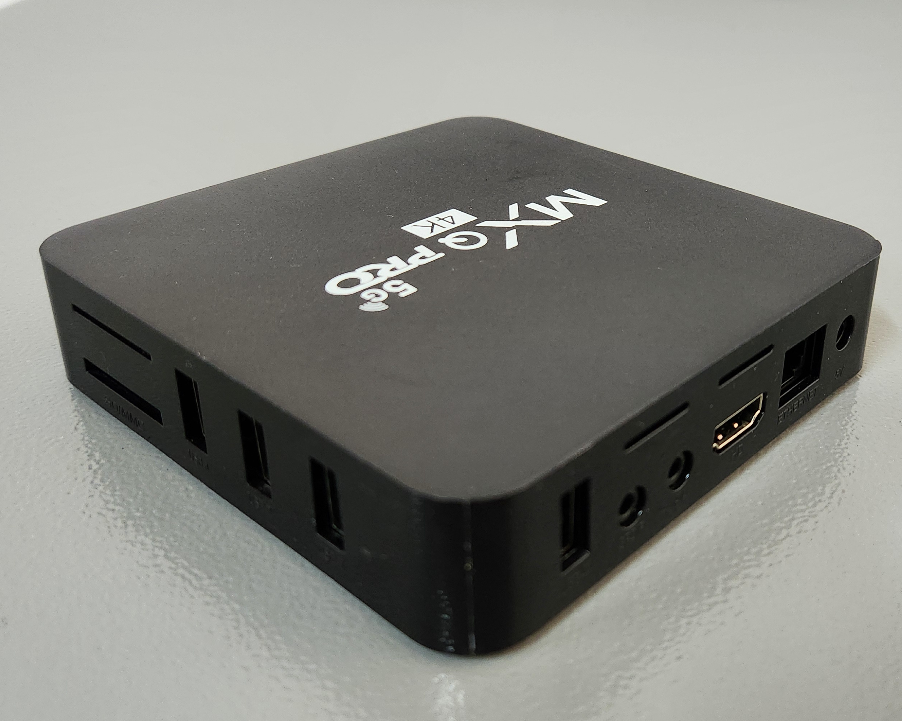

## Versão UFSCar-Sorocaba do Armbian para a MXQ-PRO e MX9 - Projeto BemTeVi

# [Download]([https://drive.google.com](https://drive.google.com/file/d/1CJywVhZO3QaW2yA1dUl1464v20l86U3K/view?usp=sharing))


## Instruções básicas


### Requisitos

Lista de material utilizado:

* MXQ-PRO-fake: O lote que tivemos acesso é diferente da versão original, e portanto, é o modelo utilizado neste manual. A versão utilizada é uma falsificação baseada no Soc da [Rockchip](http://www.rock-chips.com/), mais especificamente o modelo **rk3228a**.
    * Curiosidades: 
    [link1](https://www.youtube.com/watch?v=mR09TfH5lRk): Vídeo ensinando como identificar a diferença de um aparelho de TV Box MXQ-PRO verdadeiro do falso de uma maneira bem simples.
    
    * Especificações do modelo utilizado:  
        * Rockchip rk3228A 4-core ARMv7
        * eMCP com 1GB de RAM e 8GB de armazenamento
        * Chipset WiFi: SSV6256P
        
        |MXQ-PRO|MX9|
        |---|---|
        |||
        |||
        |||
  
* Cartão de memória microSD
* Cabo de rede Ethernet ou monitor de video e teclado
* Leitor de cartão de memória para PC
* Linux (utilizamos uma versão Debian bookworm)

| Recurso | `Status` | Observação |
| :--- | :---: | :--- |
| wifi | :white_check_mark: | 2.4GHz e 5GHz com o módulo: ssv6x5x |
| hdmi | :white_check_mark: | overlay: led-conf7 |
| gpu | :white_check_mark: | módulo: lima |
| leitor de cartão | :white_check_mark: | |
| rede | :white_check_mark: | 100Mbps |
| infra-vermelho | :white_check_mark: | precisa configurar um mapeamento pelo LIRC |
| usb 2.0 | :white_check_mark: | |
| saída audio analógica | :large_orange_diamond: | detectado mas não testado |
| saída AV | :large_orange_diamond: | não testado |
| saída audio HDMI | :large_orange_diamond: | detectado mas não testado |
| bluetooth | :red_circle: | aparentemente não suportado pelo ssv6x5x | 

### Preparação inicial
* Faça download dos arquivos:
  * [balenaEtcher](https://www.balena.io/etcher#download-etcher)
  * [MULTITOOL](https://users.armbian.com/jock/rk322x/multitool/multitool.img.xz) ou no [drive](https://drive.google.com/file/d/171dTZnzH7SuXP05Jb02D3EdcoAz8H8At/view?usp=sharing)
  * [Imagem]([https://drive.google.com/](https://drive.google.com/file/d/1CJywVhZO3QaW2yA1dUl1464v20l86U3K/view?usp=sharing)).
    * Montamos esta versão com o [Armbian](https://github.com/armbian/community/) para rk322x, incluindo alguns pacotes educacionais. A versão utilizada do Armbian está no [drive](https://drive.google.com/file/d/1yN_7W0RdHs12I0Rgp6QkX-NHljiacW4b/view?usp=sharing).

* Em seguida:
    * Abra o balenaEtcher para gravar o multitool no cartão microSD. Talvez seja necessário dar permissão de execução para o programa, para isso, dentro da pasta Downloads do seu computador use:
    ```
    chmod +x balenaEtcher-*-x64.AppImage
    ```
    Com o balenaEtcher aberto, escolha o arquivo do multitool em `Flash from file` e depois a mídia que será usada em `Select Target` (no nosso caso o cartão microSD), por fim, basta clicar em `Flash`.
    
    * No cartão microSD haverá uma partição chamada `MULTITOOL`, abra ela e copie a Imagem do Armbian para dentro da pasta `backups`, sem descompactar o arquivo.
    * Desmonte adequadamente o cartão e insira na tvbox desligada.
    * Ligue a tvbox com o cartão microSD inserido e siga os passos a seguir.

### Instalação da imagem pelo MultiTool

Antes de instalar a imagem, você pode querer fazer um backup, este é o momento. 

Para gravar a imagem, inicialize a tvbox com o cartão microSD. Aguarde a disponibilização do terminal e inicie o `MULTITOOL` pelo comando `multitool.sh`. Quando aparecer o menu, selecione a opção `restore flash`. Siga os passos para gravar a imagem. Não é necessário descompactar, o arquivo `gz` pode ser salvo diretamente na pasta `backups`.


### Agradecimentos

* Fórum da comunidade Armbian [:link:](https://forum.armbian.com/topic/12656-csc-armbian-for-rk322x-tv-boxes/)
* Receita Federal do Brasil [:link:](https://www.gov.br/receitafederal/pt-br)
* Universidade Federal de São Carlos [:link:](http://ufscar.br)
 

