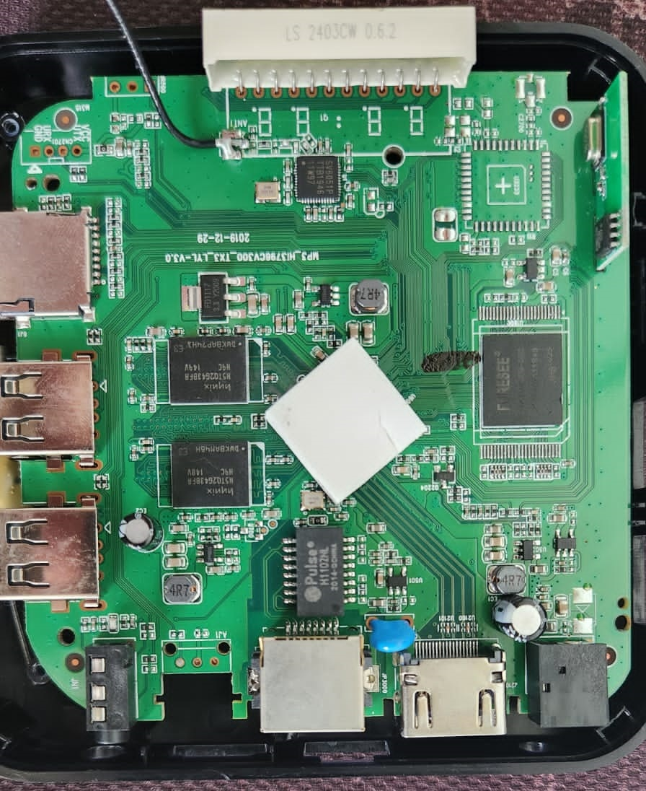
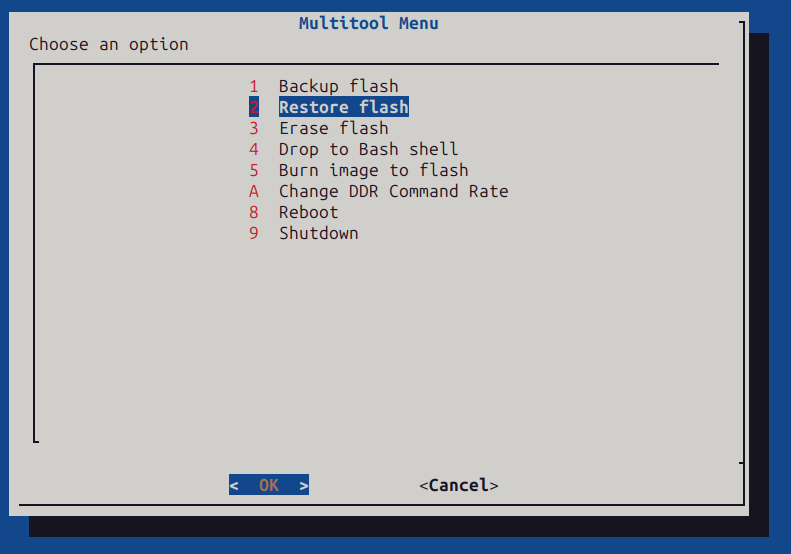

## Versão UFSCar-Sorocaba do Armbian para a TX9 - Projeto BemTeVi

# [Download](https://drive.google.com/file/d/1RXTVMk07d8pVUPnz66Lop48093ZaQMXU/view?usp=sharing)


## Instruções básicas


### Requisitos

Lista de material utilizado:

* Tx9-fake: A versão original da Tx9 é baseada no SoC da [Amlogic](https://www.amlogic.com/), mais especificamente o [S905W](https://en.wikipedia.org/wiki/Amlogic). O lote que tivemos acesso, e portanto é o modelo utilizado neste manual, é a falsificação baseada no Soc da [Rockchip](http://www.rock-chips.com/), mais especificamente o modelo **rk3228a**.
  * Curiosidades: 
    [link1](https://www.youtube.com/watch?v=bWcwqZfOcUI): Vídeo ensinando como identificar a diferença de um aparelho de TV Box TX9 verdadeiro do falso de uma maneira bem simples.
    [link2](https://www.youtube.com/watch?v=nGlpigD6uoY): Um vídeo no qual uma TV Box é analisada.

  * Especificações do modelo utilizado:
  
    * Rockchip rk3228A 4-core ARMv7
    * eMCP com 1GB de RAM e 8GB de armazenamento
    * Chipset WiFi: SSV6051P
    
    |Fechada|Aberta|
    |---|---|
    |||
    
* Cartão de memória microSD
* Cabo de rede Ethernet ou monitor de video e teclado
* Leitor de cartão de memória para PC
* Linux (utilizamos o Ubuntu Jammy)

| Recurso | `Status` |
| :---         |     :---:      |
| wifi | <code style="color : green">`Funcionando`</code> - 2.4GHz |
| hdmi | <code style="color : green">Funcionando</code> |
| gpu | <code style="color : red">Não funciona</code> |
| leitor de cartão | <code style="color : green">Funcionando</code> |
| rede | <code style="color : green">Funcionando</code> - 100Mbps |
| infra-vermelho | <code style="color : green">Funcionando</code> - precisa configurar um mapeamento pelo LIRC|
| usb 2.0 | <code style="color : green">Funcionando</code> |
| saída audio analógica | <code style="color : yellow">Não testado</code> |
| saída AV | <code style="color : yellow">Não testado</code> |
| saída audio HDMI | <code style="color : yellow">Não testado</code> |
| bluetooth | <code style="color : red">Não funciona</code> |

### Preparação inicial
* Faça download dos arquivos:
  * [balenaEtcher](https://www.balena.io/etcher#download-etcher)
  * [MULTITOOL](https://users.armbian.com/jock/rk322x/multitool/multitool.img.xz) ou no [drive](https://drive.google.com/file/d/1r1QphK06QytKCVkLkU_LETYguw1YN12T/view?usp=sharing)
  * [Imagem](https://drive.google.com/file/d/1RXTVMk07d8pVUPnz66Lop48093ZaQMXU/view?usp=sharing). Montamos esta versão com o [Armbian](https://github.com/armbian/community/) para rk322x, incluindo alguns pacotes educacionais.
    * A versão utilizada do Armbian está no [drive](https://drive.google.com/file/d/1ELnDEYH4rPU7GbWKcF4KAIYZtfvdjz4O/view?usp=sharing).

* Em seguida:
    * Abra o balenaEtcher para gravar o multitool no cartão microSD. Talvez seja necessário dar permissão de execução para o programa, para isso, dentro da pasta Downloads do seu computador use:
    ```
    chmod +x balenaEtcher-*-x64.AppImage
    ```
    Com o balenaEtcher aberto, escolha o arquivo do multitool em `Flash from file` e depois a mídia que será usada em `Select Target` (no nosso caso o cartão microSD), por fim, basta clicar em `Flash`.
    
    * No cartão microSD haverá uma partição chamada `MULTITOOL`, abra ela e copie a Imagem do Armbian para dentro da pasta `backups`, sem descompactar o arquivo.
    * Desmonte adequadamente o cartão e insira na tvbox desligada.
    * Ligue a tvbox com o cartão microSD inserido e siga os passos a seguir.

### Instalação da imagem pelo MultiTool

Antes de instalar a imagem, você pode querer fazer um backup, este é o momento. 

Para gravar a imagem, inicialize a tvbox com o cartão microSD. Aguarde a disponibilização do terminal e inicie o `MULTITOOL` pelo comando `multitool.sh`. Quando aparecer o menu, selecione a opção `restore flash`. Siga os passos para gravar a imagem. Não é necessário descompactar, o arquivo `gz` pode ser salvo diretamente na pasta `backups`.





### Agradecimentos

* Fórum da comunidade Armbian [:link:](https://forum.armbian.com/topic/12656-csc-armbian-for-rk322x-tv-boxes/)
* Receita Federal do Brasil [:link:](https://www.gov.br/receitafederal/pt-br)
* Universidade Federal de São Carlos [:link:](http://ufscar.br)
 

