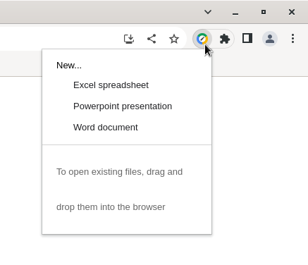

# Ícone na área do trabalho para extensão _Office Editing for Docs, Sheets & Slides_
### Solução para criar um ícone na área do trabalho que leva para uma das opções da extensão Office Editing for Docs, Sheets & Slides

### Introdução
Eu não consegui encontrar uma URL que você coloca no navegador e você cria um novo documento usando a extensão _Office Editing for Docs, Sheets & Slides_.
Quando a extensão é instalada, você pode criar um novo documento pelo PopUp no Browser, mas esse não é o objetivo.


### O que é uma extensão?
Em resumo, uma extensão (ou plugin) é uma ferramenta que acrescenta uma funcionalidade para o navegador. Ela é criada utilizando HTML, CSS e JavaScript. Ou seja, é quase um site! O que diferencia um site de uma extensão é o manifest.json, documento que diz como a extensão deve se comportar.

O nosso objetivo não é entender como que a extensão funciona por de baixo dos panos. É importante sabe que o PopUp a partir do qual você cria documentos novos é o MainPopUp, uma **visão** para o usuário utilizar o sistema.
Para atingir o objetivo proposto pelo tutorial, serão criadas três novas visões: Uma pra planilhas (Sheet), um pro PowerPoint (Point) e por fim um para os documentos (Word). Essas visões são HTMLs e para cada uma dessas ferramentas será criado um ícone na área de trabalho.
Para isso, basta criar três cópias do mainPopUp.html, que está na pasta `views` da sua extensão nesse mesmo diretório.

### Extra: Script para saber onde está o diretório de sua extensão no Linux
[path_office.sh](scripts/path_office.sh)

Em seguida, vá até o diretório de scripts. Você vai precisar criar uma cópia do MainPopUp.js e editar essa cópia. Logo você perceberá que ele está comprimido, sem identação, tab, espaço. E você vai precisar editar esse documento. Para tornar o código mais legível, copie e cole o código nessa ferramenta aqui para embelezar o JS:
[js-unminify](https://www.ipvoid.com/js-unminify/)

Feito isso, crie três cópias do MainPopUp.js para cada ferramenta. Ou seja `point.js`, `sheet.js` e `word.js`.
Aproximadamente na linha 1247, você vai mudar esse bloco de código todo

```
require(["third_party/domready/domReady!"], function () {
    require(["qowtRoot/utils/i18n"], function (d) {
        var b = d.getMessage("extension_popup_new_document_header");
        document.getElementById("newHeading").textContent = b;
        var b = d.getMessage("extension_popup_new_spreadsheet_document"),
            b = createOption(b, "sheet"),
            c = d.getMessage("extension_popup_new_presentation_document"),
            c = createOption(c, "point"),
            a = d.getMessage("extension_popup_new_word_document"),
            a = createOption(a, "word"),
            e = document.getElementById("options");
        e.appendChild(b);
        e.appendChild(c);
        e.appendChild(a);
        document.getElementById("messageBody").innerHTML = d.getMessage("extension_popup_message_body");
    });
});
```

No arquivo `point.js`, faça a seguinte alteração:

```
require(["third_party/domready/domReady!"], function () {
    require(["qowtRoot/utils/i18n"], function (d) {
        var b = d.getMessage("extension_popup_new_document_header");
        document.getElementById("newHeading").textContent = b;
        var b = d.getMessage("extension_popup_new_presentation_document"),
            b = createOption(b, "point"),
            e = document.getElementById("options");
        e.appendChild(b);
        document.getElementById("messageBody").innerHTML = d.getMessage("extension_popup_message_body");
    });
});
```

No arquivo `sheet.js`, faça a seguinte alteração:

```
require(["third_party/domready/domReady!"], function () {
    require(["qowtRoot/utils/i18n"], function (d) {
        var b = d.getMessage("extension_popup_new_document_header");
        document.getElementById("newHeading").textContent = b;
        var b = d.getMessage("extension_popup_new_spreadsheet_document"),
            b = createOption(b, "sheet"),
            e = document.getElementById("options");
        e.appendChild(b);
        document.getElementById("messageBody").innerHTML = d.getMessage("extension_popup_message_body");
    });
});
```


No arquivo `word.js`, faça a seguinte alteração:

```
require(["third_party/domready/domReady!"], function () {
    require(["qowtRoot/utils/i18n"], function (d) {
        var b = d.getMessage("extension_popup_new_document_header");
        document.getElementById("newHeading").textContent = b;
        var b = d.getMessage("extension_popup_new_word_document"),
            b = createOption(b, "word"),
            e = document.getElementById("options");
        e.appendChild(b);
        document.getElementById("messageBody").innerHTML = d.getMessage("extension_popup_message_body");
    });
});
```

Os scripts finais também estão nessa [pasta](scripts).

Feito isso, vá para a pasta `views` e dentro dela insira os HTMLs:
- [Word](html_css/word.html)
- [Sheet](html_css/sheet.html)
- [Slides](html_css/point.html)

E dentro da pasta `css`, coloque o arquivo
- [CSS desktop](html_css/desktop_individual.html)

Feito isso, para abrir uma das ferramentas pela linha de comando, execute o comando:
```
chromium chrome-extension://gbkeegbaiigmenfmjfclcdgdpimamgkj/views/sheet.html
```
Trocando o `sheet.html` por `point.html` ou `word.html`.

### Próxima tarefa:
- Fazer um script que automatize esse processo.
